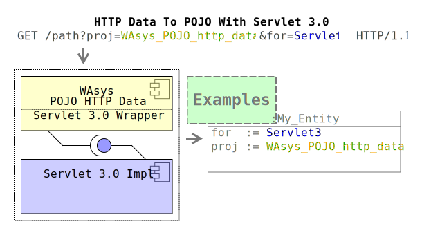

# WAsys_pojo_http_data_servlet3_wrapper_test
Sample usage for [WAsys_pojo_http_data_servlet3_wrapper](https://github.com/911992/WAsys_pojo_http_data_servlet3_wrapper) repo.

  
*diagram 0: social media vector*

This repo contains some samples of utilizing the [WAsys_pojo_http_data_servlet3_wrapper](https://github.com/911992/WAsys_pojo_http_data_servlet3_wrapper) repo with a servlet 3.0 container, e.g. Apache Tomcat.  

## Revision History
Latest: v0.2.5 (Aug 13, 2020)  
Please refer to [release_note.md](./release_note.md) file

## Requirments
0. A servlet 3.0 implemented server (like Apache Tomcat)
1. [WAsys_pojo_http_data_servlet3_wrapper](https://github.com/911992/WAsys_pojo_http_data_servlet3_wrapper) repo
2. [WAsys_pojo_http_data](https://github.com/911992/WAsys_pojo_http_data) repo
3. [WAsys_simple_generic_object_pool](https://github.com/911992/WAsys_simple_generic_object_pool) repo

## Installation
The recommended way is using NetBeans IDE. However repo(`webapp`) could be package/build using maven, or ant.

Dependent projects are all accessible from central maven repo. If your(nothis repo) web project is a maven, so you may simply add dependency for them, or simply grab the artifacts and add to the calsspath for fast testing.

For maven, dependency to `WAsys_pojo_http_data_servlet3_wrapper` is enough, since it has dependency to other required artifacts.  
```xml
<dependency>
    <groupId>com.github.911992</groupId>
    <artifactId>WAsys_pojo_http_data_servlet3_wrapper</artifactId>
    <version>0.2.5</version>
</dependency>
```

## Entries
Please considering package `wasys.lib.pojo_http_data.servlet3_wrapper_test.servlet` that contains `web.xml` mapped `HttpServlet`s. Each `HttpServlet` is assumed to perform a specific sample usage.

Related entities(`Fillable_Object`s) are all located in `wasys.lib.pojo_http_data.servlet3_wrapper_test.entity` package.

Please check `web.xml` file to find out Servlet-path mappings, beside there is an assoctaed welcome-page for the project at `/` root path.

Default context path is `WAsys_pojo_http_data_servlet3_wrapper_test`, which could be edited in `context.xml` file.

### Filling Scenarios
Considering followings, as implemented scenarios for possible object filling(utilizing the lib) 

**Note:** all filling processes are done by **`POST`** method, while required forms are provided by *`GET`* method.

<hr/>

#### Sample 0: Login
Assuming a very simple login form, requires an email, and password
* **Path**: `/smaple0`  
* **Requried Parameters**  
    * `email`: should not be null, and must be less than 320 charaters long  
    * `pass`: should not be null, must have at-least 4 characters long  
* **Servlet class**: `Sample0_Login`  
* **Entity(s)**: `Sample0_Login_Entity`  
* **Expectation**: confirm the submit-ed data

<hr/>

#### Sample 1: Add Two Numbers
Adding two numbers  
* **Path**: `/smaple1`  
* **Requried Parameters**  
    * `a`: should not be null, must be between 0 to 127  
    * `b`: should not be null, must be between 0 to 256
* **Servlet class**: `Sample1_Calc_Add`  
* **Entity(s)**: `Sample1_Calc_Entity_Pooled`  
* **Expectation**: Add `a` to `b`

<hr/>

#### Sample 2: `ls` A Directory
list files of a directory (`multipart`)
* **Path**: `/smaple2`  
* **Requried Parameters**  
    * `path`: can be nullable/empty(will use `./`), must be between 1 to 255 character len  
* **Servlet class**: `Sample2_Read_Dir_Multipart_Form`  
* **Entity(s)**: `Sample2_Read_Dir_Entity`  
* **Expectation**: list the availble files of requested `path` server directory

<hr/>

#### Sample 3: Image Upload And Manipulation
Upload an image using `Pass_Stream` mode, invert the colors on fly and return it (no file save) (`multipart`)
* **Path**: `/smaple3`  
* **Requried Parameters**  
    * `img`: must be a non-null file less than 5242880 Bytes(5MB), should be a valid image file(`jpeg`/`png`).  
* **Servlet class**: `Sample3_File_Upload_Handle_Image_Pass_Stream`  
* **Entity(s)**: `Sample3_Image_File_Process_Entity`  
* **Expectation**: load and invert the uploaded `img` on fly(memory), and return the result  

<hr/>

#### Sample 4: File Upload To A Directory
Uploading a file to a specified directory(must be present in server side) using `Stream_To_Field` streaming mode  (`multipart`)
* **Path**: `/smaple4`  
* **Requried Parameters**  
    * `dir`: name of the directory, should have at-least 1 char len  
    * `file`: a file with at-least 1 byte size
* **Servlet class**: `Sample4_File_Upload_Save_Stream_Mode`  
* **Entity(s)**: `Sample4_File_Upload_Save_Entity`  
* **Expectation**: Saving the uploaded `file` (not with exact uploaded-file name) to the specified `dir` in server  
